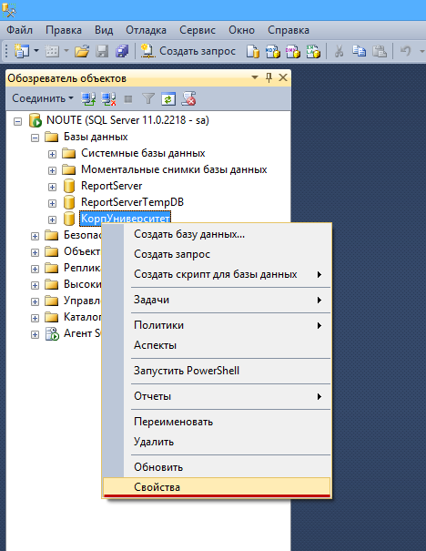
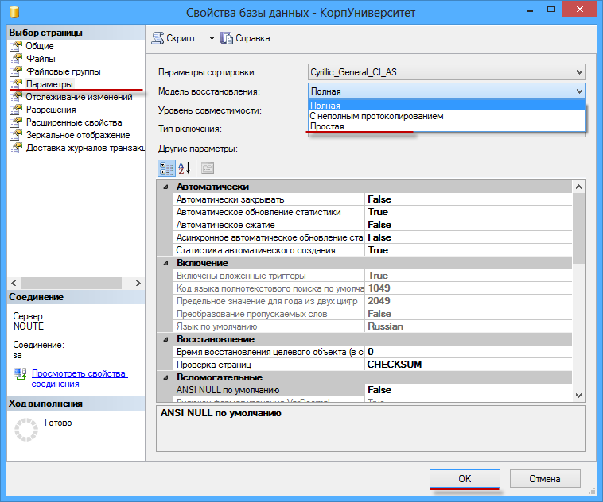
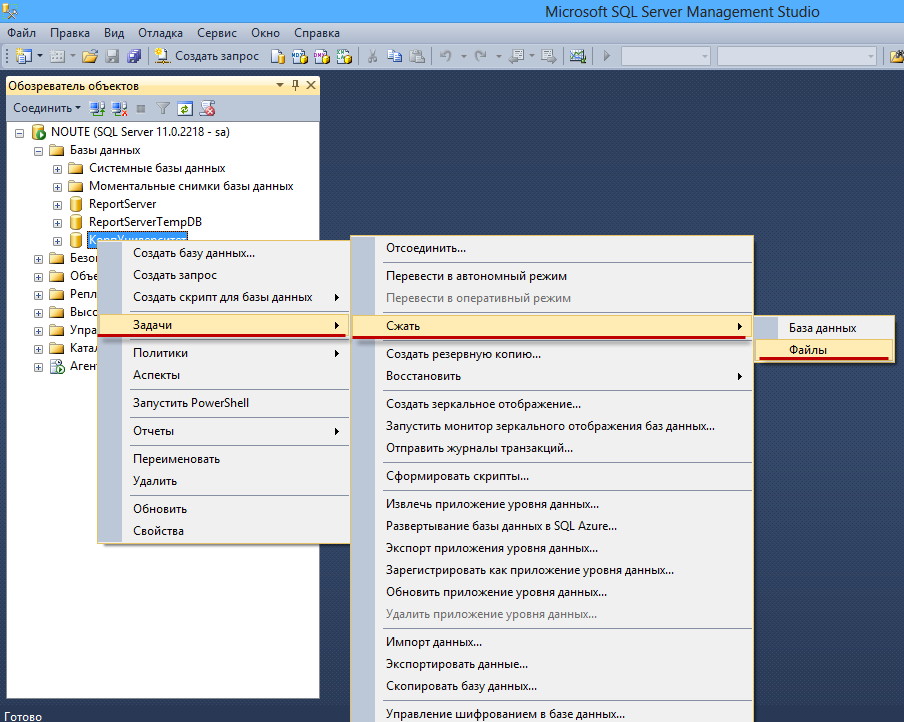
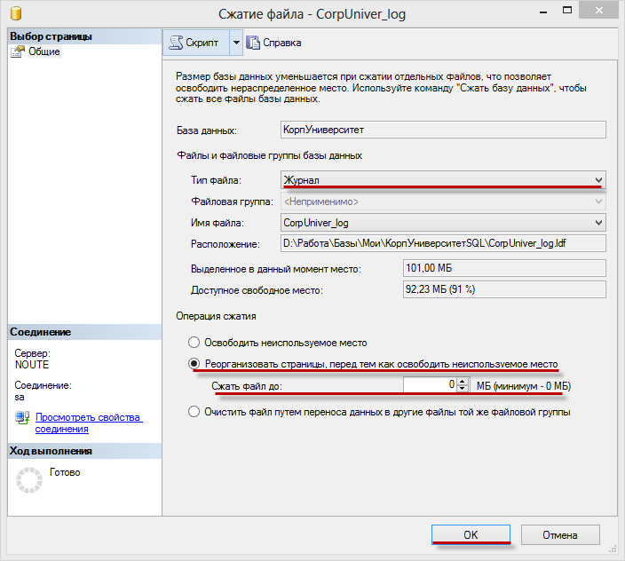
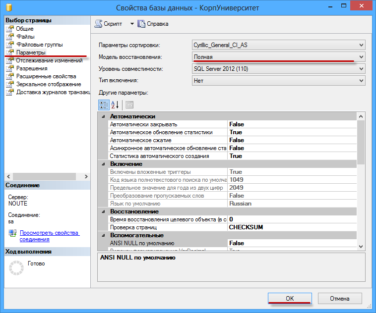

# MS-SQL

## Уменьшение лога транзакций (*.ldf)

Когда при подключении к базе MS SQL появляются ошибки:
```
Ошибка СУБД:
Microsoft OLE DB Provider for SQL Server: Журнал транзакций для базы данных "ReportServer" заполнен. Чтобы обнаружить причину, по которой место в журнале не может быть повторно использовано, обратитесь к столбцу log_reuse_wait_desc таблицы
sys. databases HRESULT=80040E14, SQLStvr: Error state=2, Severity=11,native=9002, line=1
```
или
```
Ошибка СУБД:
Microsoft OLE Provider for SQL Server: The transaction log for database “ReportServer” is full. To find out why space in the log cannot be reused, see the log_reuse_wait_desc column is sys.database
HRESULT=80040E14, SQLSTATE=4 2000, native=9002
```
это значит, что на диске, где расположен лог транзакций закончилось место и теперь СУБД некуда записывать данные о новых транзакциях. Чаще всего такое происходит, когда не установлено никаких ограничений на размер лога и в MS SQL не создано соответствующих планов обслуживания.

В таком случае нужно уменьшить размер самого файла транзакций (*.ldf), другими словами сделать шринк (сжатие) лога. Для этого можно использовать как запрос, так и сжатие лога вручную.

Рассмотрим сжатие лога транзакций вручную:

**Шаг 1.** Установить модель восстановления Простая (Simple). Правой кнопкой на базе - Свойства(Properties) - Параметры(Options) - 4-й сверху пункт Модель восстановления(Recovery model) - Простая(Simple) - OK.




**Шаг 2.** Выполнить шринк (сжатие) лога транзакций. Правой кнопкой на базе - Задачи(Tasks) - Сжать(Shrink) - Файлы(Files) - установить Тип файла(File type) - Журнал(Log) - в Операция сжатия(Shrink action) - выбрать Реорганизовать страницы, перед тем осводить неиспользуемое место(Reorganize pages before releseasing unused space) - Сжать файл (Shrink file to) - указать приемлемый размер лога.




**Шаг 3.** Установить модель восстановления Полная(Full). Правой кнопкой на базе - Свойства(Properties) - Параметры(Options) - 4-й сверху пункт Модель восстановления(Recovery model) - Полная(Full) - OK.

